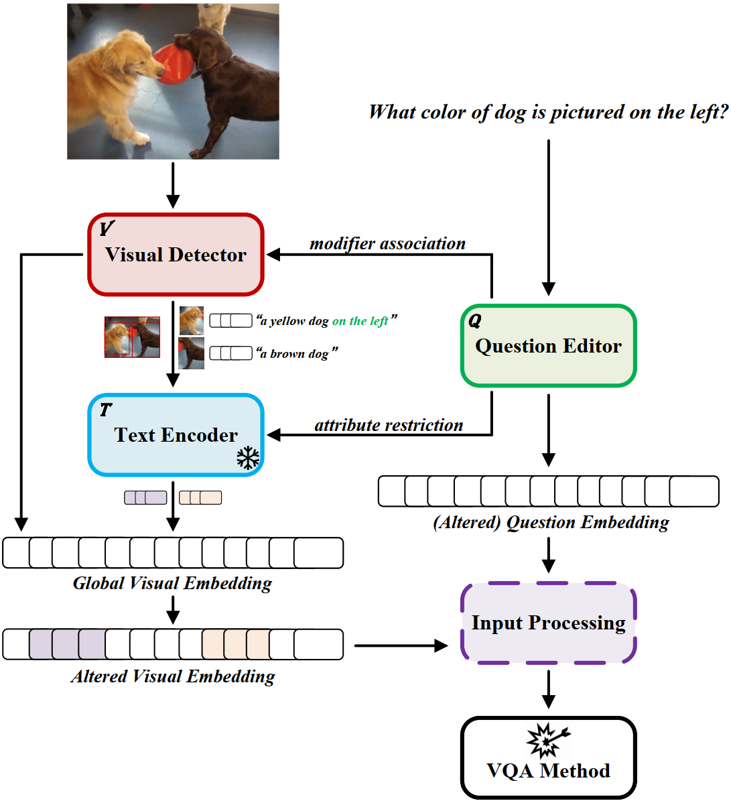
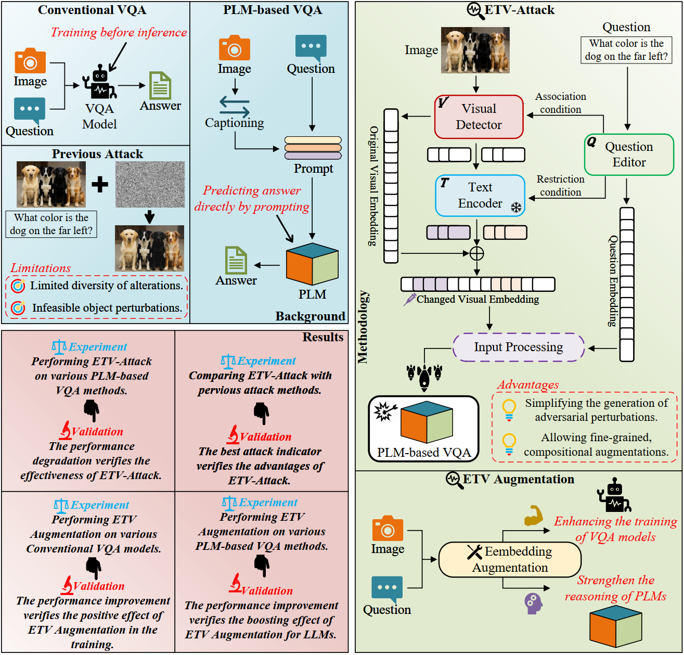

# ETV-Attack
**ETV-Attack: Efficient Text-Driven Visual-Variable Adversarial Attacks on Visual Question Answering with Pre-trained Language Models.**
## Concept
The design of ETV-Attack is grounded in two key premises. First, large-scale pre-training endows PLMs with rich implicit visual knowledge, enabling their encoders to capture high-level semantic representations that transcend modality boundaries. Second, visual attribute transformations (e.g., changes in color, size, or texture) can be effectively modeled as linear operations in the embedding space, without requiring explicit pixel-level manipulation. Building upon these insights, ETV-Attack introduces a text-guided embedding-level augmentation mechanism that simulates object-level visual variations without modifying the raw image. 

## Overview

